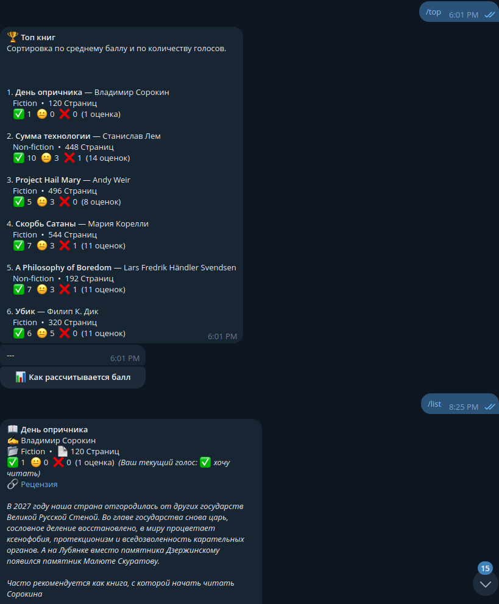
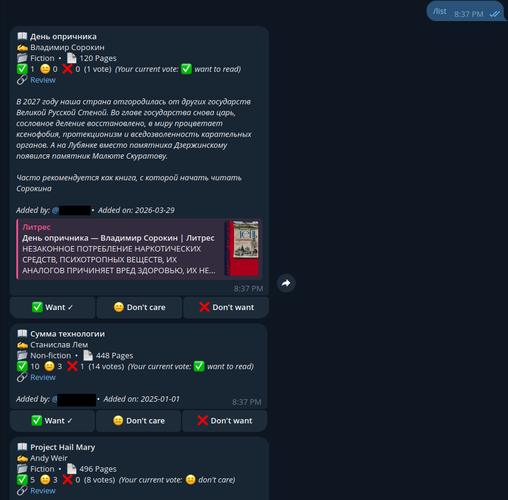
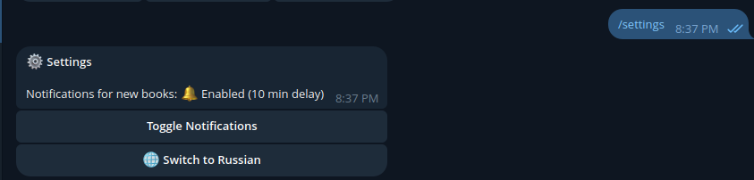

# 📚 Book Club Telegram Bot

A bilingual (English/Russian) Telegram bot to help book clubs manage their reading lists, vote on upcoming books, and track their reading history.

## 🌟 Features

- **Bilingual Support:** Switch between English and Russian in the `/settings` menu.
- **Book Management:** Add books with details like title, author, page count, fiction/non-fiction status, review links, and descriptions.
- **Voting System:** Users can vote on books with three options:
  - ✅ **Want to read** (+1 point)
  - 😐 **Don't care** (0 points)
  - ❌ **Don't want to read** (-1 point)
- **Top Rated Books:** View a list of undiscussed books ranked by their average score and vote count.
- **Smart Notifications:** 
  - Get notified when a new book is added (with a 10-minute delay).
  - Notifications include a voting card to vote directly from the message.
  - Opt-in or out via `/settings`.
  - **Admin Notifications:** The main admin (first ID in `ADMIN_IDS`) receives notifications when the bot starts up or shuts down.
- **Access Control:** Optionally restrict bot usage to members of a specific Telegram chat (via `ALLOWED_CHAT_ID`). For this bot should be inside the chat too
- **Archive:** Track books that have already been discussed.

## 🛠 Commands

### User Commands
- `/start` or `/help`: Welcome message and command list.
- `/info`: About the bot and last update time.
- `/add`: Add a new book to the list.
- `/list`: See all undiscussed books (option to filter for unvoted only).
- `/top`: See the highest-rated books.
- `/settings`: Change your notification and language preferences.
- `/edit`: Edit a book's details (limited to book owner or admins).
- `/delete`: Delete a book (limited to book owner or admins).
- `/discussed`: View books already discussed by the club.
- `/cancel`: Abort the current interactive command.

### Admin Commands
- `/markdiscussed`: Mark a specific book as discussed (with a date).

## 🖼 Screenshots




## 🚀 Getting Started

### Prerequisites
- Docker and Docker Compose
- A Telegram Bot Token (from [@BotFather](https://t.me/BotFather))

### Setup
1. **Clone the repository:**
   ```bash
   git clone <repository_url>
   cd book-club-bot
   ```

2. **Configure environment variables:**
   Create a `.env` file in the project root with the following content:
   ```env
   BOT_TOKEN="your_token_from_BotFather"
   ADMIN_IDS="ID_1,ID_2"
   GITHUB_REPO="https://github.com/yourusername/your-repo"
   ALLOWED_CHAT_ID="CHAT_ID"  # Optional: Restrict bot usage to members of this chat
   ```

3. **Run the bot using Docker:**
   ```bash
   docker compose up -d
   ```

## 🧪 Testing

The project includes a suite of unit and integration tests.

To run tests using Docker:
```bash
docker compose run --rm bot python -m unittest discover tests
```

### Git Pre-commit Hook

To ensure tests pass before every commit, a Git pre-commit hook has been added. It automatically runs the test suite using Docker.

If you need to install it manually on another machine:
1. Create `.git/hooks/pre-commit` with the following content:
```bash
#!/bin/bash
docker compose run --rm bot python -m unittest discover tests
```
2. Make it executable: `chmod +x .git/hooks/pre-commit`

Or manually in a virtual environment:
```bash
python3 -m venv .venv
source .venv/bin/activate
pip install -r requirements.txt
python -m unittest discover tests
```
