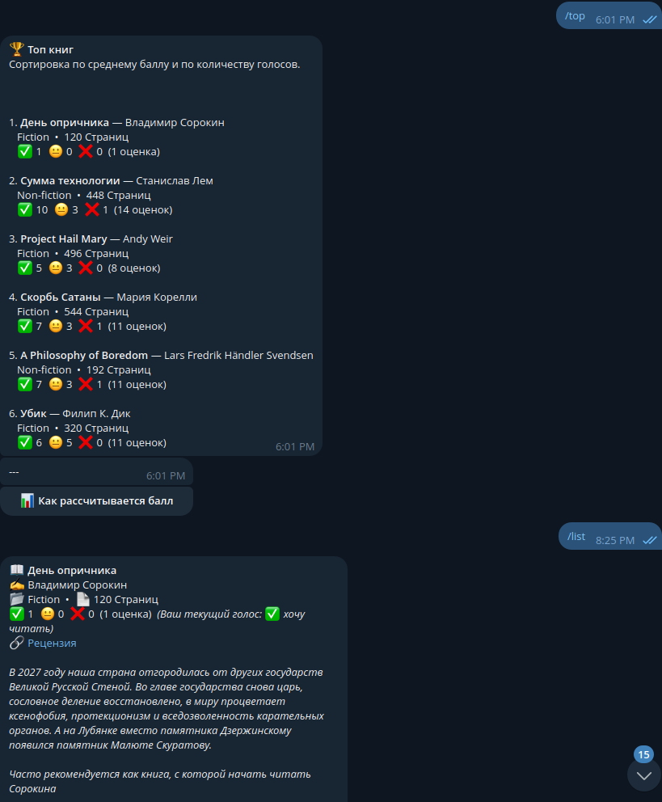
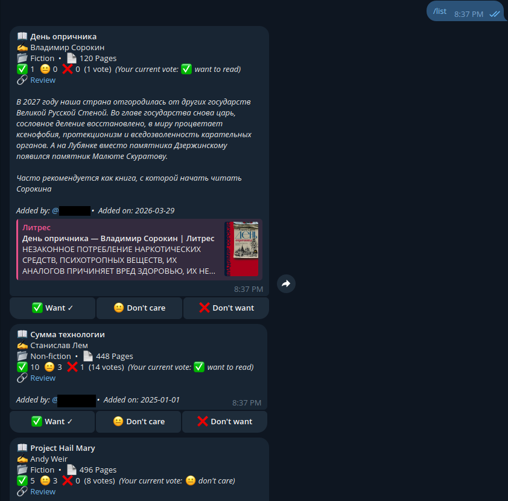
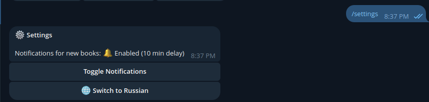

# 📚 Book Club Telegram Bot

A bilingual (English/Russian) Telegram bot to help book clubs manage their reading lists, vote on upcoming books, and track their reading history.

## 🌟 Features

- **Bilingual Support:** Switch between English and Russian in the `/settings` menu.
- **Book Management:** Add books with details like title, author, page count, fiction/non-fiction status, review links, and descriptions.
- **Voting System:** Users can vote on books with three options:
  - ✅ **Want to read** (+1 point)
  - 😐 **Don't care** (+0.5 points)
  - ❌ **Don't want to read** (-1 point)
- **Top Rated Books:** View a list of undiscussed books ranked by their votes score.
- **Smart Notifications:** 
  - Get notified when a new book is added (with a 10-minute delay).
  - Notifications include a voting card to vote directly from the message.
  - Opt-in or out via `/settings`.
  - **Admin Notifications:** The main admin (first ID in `ADMIN_IDS`) receives notifications when the bot starts up or shuts down.
  - **Voting Reminders:** Admins can send reminders to users who haven't voted for top-rated books or specific titles.
  - **Group Chat Notifications:** Optionally post new book announcements directly to the club chat (toggleable in `/adminconsole`).
- **Access Control:** Optionally restrict bot usage to members of a specific Telegram chat (via `ALLOWED_CHAT_ID`). For this bot should be inside the chat too
- **Archive:** Track books that have already been discussed.

## 🛠 Commands

### User Commands
- `/start` or `/help`: Welcome message and command list.
- `/info`: About the bot and last update time.
- `/add`: Add a new book to the list.
- `/list`: See all undiscussed books (option to filter for unvoted only).
- `/top`: See the highest-rated books.
- `/settings`: Change your notification and language preferences.
- `/edit`: Edit a book's details (limited to book owner or admins).
- `/delete`: Delete a book (limited to book owner or admins).
- `/discussed`: View books already discussed by the club.
- `/cancel`: Abort the current interactive command.

### Admin Commands
- `/adminconsole`: Centralized panel for admins to:
  - **Mark discussed:** Mark a book as discussed and move it to the archive.
  - **Hide books:** Temporarily hide books from the `/list` and `/top` without deleting them.
  - **Send Reminders:** Broadcast a voting reminder to all users for either the current Top 5 books or a specific selected book.
  - **Chat Notifications:** Toggle whether new books should be posted to the group chat automatically.

## 🖼 Screenshots




## 🚀 Getting Started

### Prerequisites
- Docker and Docker Compose
- A Telegram Bot Token (from [@BotFather](https://t.me/BotFather))

### Setup
1. **Clone the repository:**
   ```bash
   git clone <repository_url>
   cd book-club-bot
   ```

2. **Configure environment variables:**
   Create a `.env` file in the project root with the following content:
   ```env
   BOT_TOKEN="your_token_from_BotFather"
   ADMIN_IDS="ID_1,ID_2"
   GITHUB_REPO="https://github.com/yourusername/your-repo"
   ALLOWED_CHAT_ID="CHAT_ID"  # Optional: Restrict bot usage to members of this chat
   CHAT_LANG="ru"             # Optional: Language for messages posted to the group chat (default: ru)
   INSTANCE_NAME="book-club"  # Optional: Label prepended to error alerts (see "Logs & error alerts")
   ERROR_ALERTS="1"           # Optional: Forward ERROR-level logs to the main admin (default: on)
   ```
   `CHAT_LANG` applies only to shared group posts (new-book announcements and the
   vote cards attached to them). Messages sent to individuals always follow that
   person's own `/settings` language.

3. **Run the bot using Docker:**
   ```bash
   mkdir -p data
   docker compose up -d
   ```

(if not yet installed before, install docker as in https://docs.docker.com/engine/install/ubuntu/)

## 🛡️ Backups

To ensure your data is safe, a backup script `scripts/remote_backup.sh` is provided. It creates a "safe" snapshot of the SQLite database while the bot is running to avoid corruption.

### Pull Backups (From another machine - Recommended)

If you want to run the backup from a **different Linux machine** (e.g., a dedicated backup server), use `scripts/remote_backup.sh`. This script connects to your bot server via SSH, triggers a safe backup, and pulls the file back to the local machine.

1.  **Copy the script** to your backup machine.
2.  **Configure the variables** inside `scripts/remote_backup.sh` (IP address, user, paths).
3.  **Ensure SSH Key-based authentication** is set up between the machines for automation.
4.  **Run it:** `./remote_backup.sh [bot-name]`

If you provide an argument, it will be used as the subfolder name on the remote server and included in the local filename. Defaults to `book-club-bot`.

### Regular Backups (Recommended)
Add a cron job to run the backup daily at 2:00 AM:
1. Open crontab: `crontab -e`
2. Add the following line (adjust the path to your bot directory):
   ```cron
   0 2 * * * /bin/bash /path/to/remote_backup.sh >> /path/to/book-club-bot/logs/backup.log 2>&1
   ```

## 🚀 Deploying updates

`scripts/deploy_bots.sh` updates one or more running instances on the server:
for each configured instance it checks whether anyone has actually been using
the bot recently and asks for confirmation. After you have decided for every
instance, selected updates run in parallel: stop containers, pull the latest
code, and bring them back up rebuilt (`docker compose up -d --build`).

The activity check reads `last_non_admin_activity` from the bot's own
persistence file (`data/bot_persistence`) — the same timestamp
`membership_gate()` stamps on every non-admin update. Admin activity never
counts as "in use", so testing the deploy yourself doesn't block the next run.

1. Create `scripts/deploy_bots.local.sh` (gitignored, sourced by `deploy_bots.sh`
   if present) with the list of instance subfolders on this server:
   ```bash
   REPOS=(
       "/root/book-club-bot"
       # "/root/another-club-bot"
   )
   ```
2. Run it: `./scripts/deploy_bots.sh`
   - `--check-only` — report activity status for every instance and exit; changes nothing.
   - `--yes` — auto-confirm instances with no recent activity; instances that look active are still prompted.
   - `--skip-active` — combine with `--yes` for unattended/cron use: idle instances are updated, active ones are skipped without prompting.
   - `--threshold <minutes>` — how recent counts as "active" (default 10).

An instance with uncommitted local changes is always skipped rather than
pulled over. If `git pull` or the rebuild fails partway through, the script
tries to bring the previous containers back up rather than leaving the bot
down, and exits nonzero if anything failed — useful for alerting if run from cron.

**Why not Kubernetes?** These bots are single-process, long-polling (no
inbound HTTP traffic to load-balance), and keep their state in a local SQLite
file and a pickle file — the opposite of the stateless, horizontally-scaled
workload Kubernetes is for. Running each instance as a separate `docker
compose` stack on one small VPS, updated by this script, is simpler to
operate and debug for this shape of workload. If instance count grows large
enough that per-server `REPOS` lists become unwieldy, a lighter next step
than Kubernetes would be a `systemd` timer calling this script instead of
cron (structured logs via `journalctl`), or moving `REPOS` into a small
inventory file read by the script.

## 🔎 Logs & error alerts

Each instance writes to `logs/bookclub_bot.log` (rotated at 5 MB, 3 backups
kept) as well as to the container's stdout (`docker compose logs`). Two things
make failures easier to catch when something breaks.

### Get alerted when an error happens

Anything logged at `ERROR` or above — including every unhandled exception
caught by the global error handler — is forwarded to the main admin (the first
ID in `ADMIN_IDS`) as a Telegram message, so you find out without watching the
logs. Alerts are coalesced (up to a few errors per message, at most one message
every few seconds) so an error storm can't turn into a notification storm.

- On by default whenever `ADMIN_IDS` is set. Disable with `ERROR_ALERTS=0`.
- Set `INSTANCE_NAME` (e.g. `philo-club`) so a shared admin can tell which bot
  an alert came from — it's prepended to every alert.

### Search logs across all instances

`scripts/logs.sh` searches and tails the logs of **every** instance on the
server from one place, prefixing each line with the instance it came from so
you don't have to `grep` three separate files by hand. It reuses the same
`REPOS` list as `deploy_bots.sh` (from `scripts/deploy_bots.local.sh`).

```bash
./scripts/logs.sh                # last 50 ERROR/WARNING lines across all bots
./scripts/logs.sh -e             # errors only (ERROR/CRITICAL)
./scripts/logs.sh -g "notify"    # lines matching a regex
./scripts/logs.sh -b philo -e    # errors from instances whose name matches "philo"
./scripts/logs.sh --today -e     # today's errors only
./scripts/logs.sh -f             # live tail (ERROR/WARNING) — add -a for everything
```

Run `./scripts/logs.sh --help` for the full flag list.

**Why not Prometheus / Loki / ELK?** Prometheus stores *numeric metrics*, not
log text, so it can't answer "what was the error message?" — the log-search
tool in that ecosystem is Grafana Loki. A full Loki+Grafana (or ELK) stack is
real value once you have many services or need dashboards and long retention,
but for a handful of single-process bots on one VPS it's more moving parts to
run and secure than the problem needs. Push-on-error (above) plus a
cross-instance `grep` wrapper covers "tell me when it breaks" and "let me find
the error" without new infrastructure. If the fleet grows, the natural next
step is shipping these same log files to Loki via Promtail.

## 🧪 Testing

The project includes a suite of unit and integration tests.

To run tests using Docker:
```bash
docker compose run --rm \
  -v "$(pwd)/bookclub_bot.py:/app/bookclub_bot.py:ro" \
  -v "$(pwd)/tests:/app/tests:ro" \
  bot python -m unittest discover tests
```

### Git Pre-commit Hook

To ensure tests pass before every commit, a Git pre-commit hook has been added. It automatically runs the test suite using Docker.

If you need to install it manually on another machine:
1. Create `.git/hooks/pre-commit` with the following content:
```bash
#!/bin/bash
docker compose run --rm \
  -v "$(pwd)/bookclub_bot.py:/app/bookclub_bot.py:ro" \
  -v "$(pwd)/tests:/app/tests:ro" \
  bot python -m unittest discover tests
```
2. Make it executable: `chmod +x .git/hooks/pre-commit`

Or manually in a virtual environment:
```bash
python3 -m venv .venv
source .venv/bin/activate
pip install -r requirements.txt
python -m unittest discover tests
```
